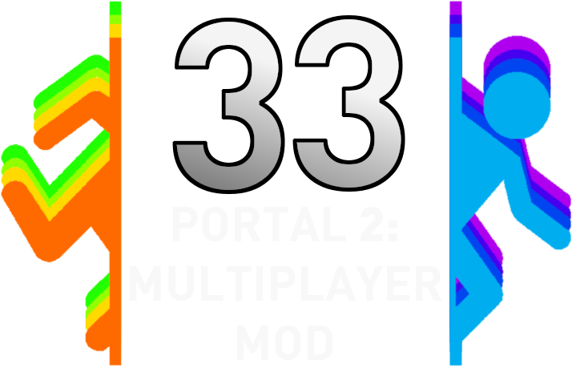

<h1>
  
  <a href="https://discord.gg/nXRygGNxyK">
    
  </a>
  <br>
  <a href="https://github.com/kyleraykbs/Portal2-32PlayerMod/releases/latest">
    
  </a>
  <br>
  <a href="https://github.com/kyleraykbs/Portal2-32PlayerMod/commits/main">
    
  </a>
  <br>
    <a href="https://github.com/kyleraykbs/Portal2-32PlayerMod/releases/latest">
  </a>
  <br>
  <br>
  <br>
  <p align="right">PORTAL 2: MULTIPLAYER MOD</p>
</h1>

### Este mod es completamente server-side. Solo el operador del servidor necesita ejecutar Portal 2 con el mod instalado. Los jugadores que se unen al host deben ejecutar Portal 2.
## Caracteristicas del Mod
```
  - Una capacidad de 33 jugadores
  - Nametags
  - Colores personalizados del jugador
  - Comandos de chat (!help)
  - Sistema de admnistrador en el juego
  - Compatibilidad completa para campañas cooperativas
  - Compatibilidad completa para campaña de un solo jugador (necesita un pulido menor)
  - Compatibilidad total con el mapa Super 8
  - Soporte completo para mapas seleccionados de la Workshop
  - Encryption of client commands invoked through the active GameRules class
  - Soporte para Linux, Windows 7 y versiones posteriores
  - Opciones de juego y sistema de configuración a traves de VScript y un plugin personalizado
  - Soporte para SAR (SourceAutoRecord) para el speedrunning
  - Soporte nativo para servidores dedicados si logras hacer que uno funcione :)
```

## Características por añadir
- Soporte para Steam Deck/SteamOS 3.0
- Discord API para invitaciones
- Más soporte para mapas de la Workshop
- Soporte FastDL

# Instalación y uso

**Guía de Steam sobre cómo hostear y unirse a un juego:**
- https://steamcommunity.com/sharedfiles/filedetails/?id=2458260280

**Ultima version:**
- https://github.com/kyleraykbs/Portal2-32PlayerMod/releases/latest

**Servidor de discord para obtener ayuda (ASEGURATE DE HABER LEIDO LAS PyR), para reportar errores o solo hablar:**
- https://discord.gg/kW3nG6GKpF


# Build

*Usamos Python 3.10 para el lanzador*

**Dependencias**
- pygame
- pyperclip
- requests
- steamid-converter

También los tenemos en un archivo para una instalación fácil `pip install -r requirements.txt`

**Compilación**

Usamos `pyinstaller` para hacer el ejecutable
- Windows:

```
pyinstaller "src/MainWindow.py" -F -i "src/GUI/assets/images/p2mm64.ico" --noconsole --add-data "src/GUI;GUI" --add-data "src/ModFiles;ModFiles" --add-data "src/languages;languages"
```

- Linux:

```
pyinstaller "src/MainWindow.py" -F --add-data "src/GUI:GUI" --add-data "src/ModFiles:ModFiles" --add-data "src/languages:languages"
```

*Nota:*
- Si quieres crear un fork del proyecto y hacer tus propios lanzamientos, debes cambiar las variables en la parte superior de `src/Scripts/Updater.py` a tu propia información.


# Contribuciones

We are always happy to take whatever additional help we can get for this project. Specifically, we are in need of proficient coders in Squirrel or C++. If you think you can spare a hand, it will go a long way!
Siempre nos complace aceptar cualquier ayuda adicional que podamos obtener para este proyecto. Específicamente, necesitamos programadores competentes en Squirrel o C++. Si crees que puedes echar una mano, ¡nos será muy útil!

# Creditos

**Desarrolladores:**
- kyleraykbs
- Bumpy
- Nanoman2525
- vista
- Wolƒe Strider Shoσter
- cabiste
- zwexit (Orsell) 

**Colaboradores:**
- wanderer (free bird)
- \n
- Luukex
- MeblIkea
- Luukex
- PieCreeper
- Areng
